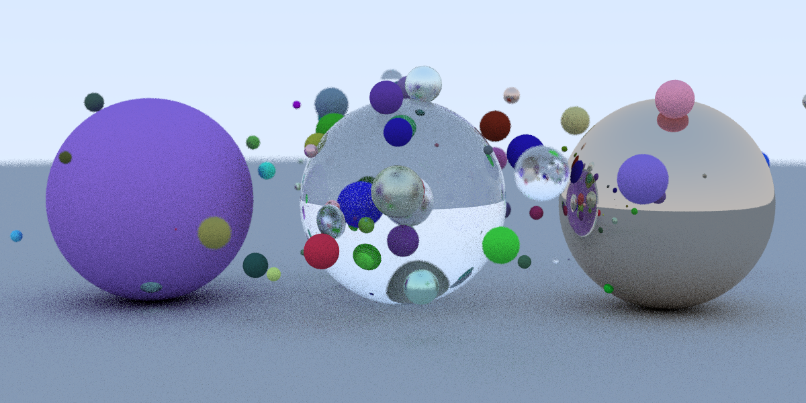

# RayTracer
A general ray tracer written in C++ based on the book Ray Tracing in One Weekend, by Peter Shirley.

Features include: 

    - vec3 class
    
    - Simple camera
    
    - Materials (diffuse, metal, clear) 
    
    - Generates and renders a random scene of spheres with different sizes and materials

Here are a couple images I produced with the ray tracer:

  
  

